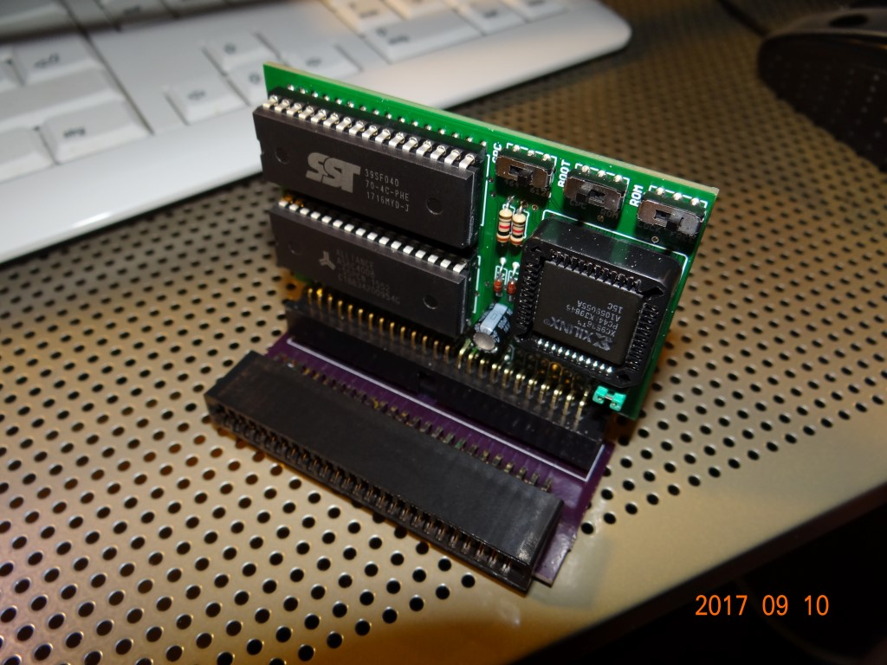
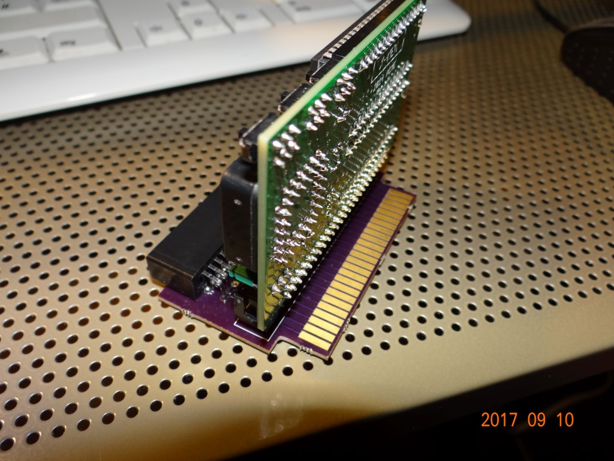
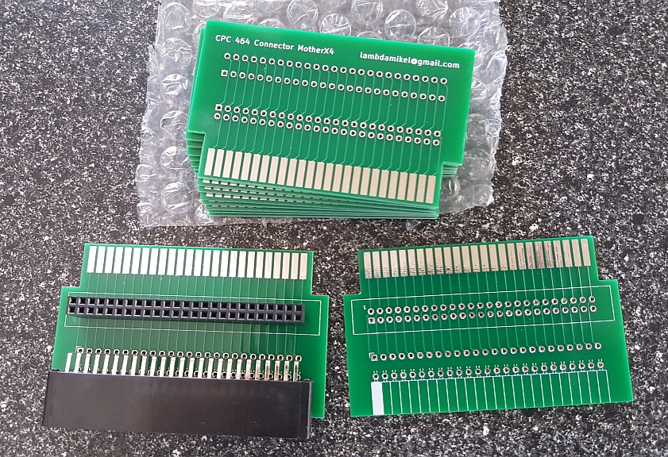
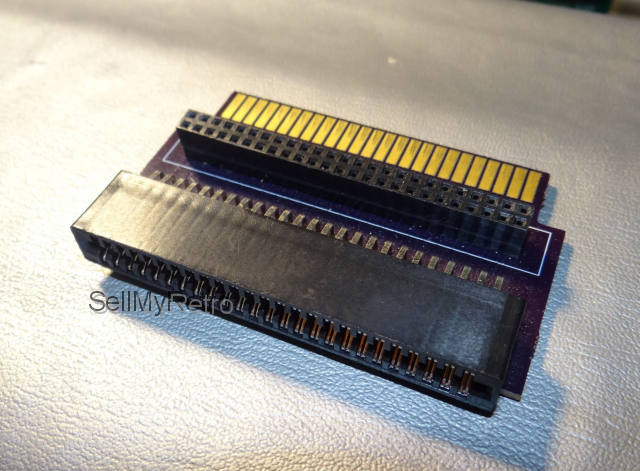

# CPC Connector
A Expansion Port Connector for the Amstrad / Schneider CPC

## Purpose 

Add 1 MX4-compatible expansion card slot to your Amstrad / Schneider CPC, without loosing the edge connector.

Key features are: 
1. 1 standard MX4 expansion slots 
2. Passthrough edge connector

## Application Examples 

  
  
  
  

## Gerbers 

The Gerbers are [here](gerbers/cpc-connector.zip). 

## OshPark Link 

Also, [here is a link to OshPark for immediate ordering of PCBs.](https://oshpark.com/shared_projects/3yA33GYO) 

## Enjoy! 

